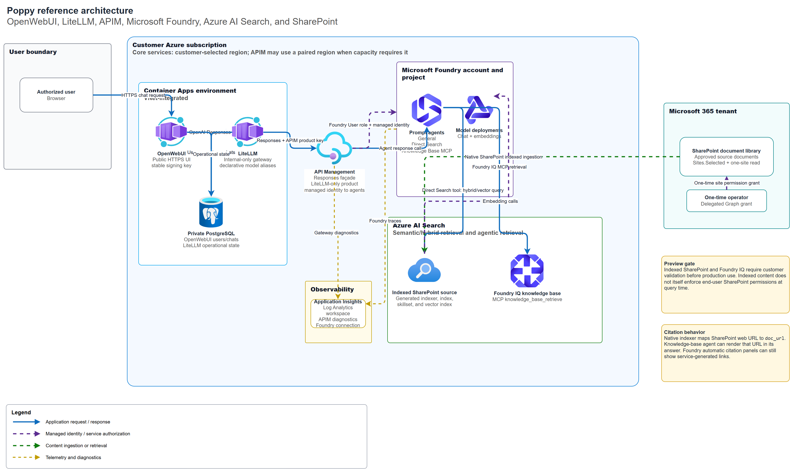

# OpenWebUI, LiteLLM, Foundry, and SharePoint Reference Architecture

This document describes a production-shaped reference implementation for a
customer-operated OpenWebUI experience that uses stock OpenWebUI and LiteLLM
containers, Microsoft Foundry prompt agents, Azure AI Search, and SharePoint
content.

> [!IMPORTANT]
> Indexed SharePoint knowledge sources, Foundry IQ, and agentic retrieval are
> preview capabilities. Validate service availability, supported regions,
> limits, security behavior, and contractual suitability before production use.

## Architecture



The editable source is
[`poppy-reference-architecture.drawio`](architecture/poppy-reference-architecture.drawio).

OpenWebUI is the public user interface. LiteLLM is internal-only and exposes
declarative model aliases. APIM is the OpenAI Responses compatibility boundary:
it adds the Foundry API version, authenticates to Foundry with managed identity,
removes caller-owned tool definitions that agent-bound endpoints reject, and
emits diagnostics.

## Retrieval options

| Model alias | Retrieval path | Use it for |
|---|---|---|
| `poppy-general-agent-responses` | General Foundry prompt agent | Ungrounded general assistance |
| `poppy-direct-search-responses` | Foundry Azure AI Search tool | Direct hybrid/vector search against one index |
| `poppy-knowledge-base-responses` | Foundry IQ knowledge-base MCP tool | Managed, agentic retrieval across knowledge sources |
| `gpt-5.4`, `gpt-5.4-mini` | LiteLLM direct Foundry deployment aliases | Direct model access without APIM/agent tools |

The direct Search agent and the Foundry IQ agent should be separate models so
users can compare retrieval behavior and citations.

## SharePoint permissions

The initial least-privilege pattern separates human administration from runtime
ingestion.

| Principal | Responsibility | Required access |
|---|---|---|
| Licensed SharePoint owner | Create the isolated site and upload approved content | Site owner |
| One-time Entra/SharePoint operator | Grant the runtime application access to that site | SharePoint Administrator or Global Administrator plus delegated Microsoft Graph `Sites.FullControl.All` for the grant operation |
| SharePoint indexer application | Read the approved SharePoint site at runtime | Microsoft Graph application `Sites.Selected` plus an explicit site-level `read` grant |
| Azure AI Search managed identity | Authenticate to the SharePoint indexer application and call embeddings | Federated identity credential on the indexer application; `Cognitive Services User` on Foundry |

`Sites.FullControl.All` is an operator-side, one-time delegated permission. Do
not assign it to the runtime indexer application.

## Infrastructure and configuration ownership

| Artifact | Owner | Purpose |
|---|---|---|
| `infra/main.bicep` and `infra/core/*.bicep` | Bicep | Azure resources, managed identities, RBAC, APIM products/APIs/subscriptions, Container Apps, and Foundry Search connections |
| `infra/app/litellm-config.yaml` | LiteLLM configuration-as-code | Static model aliases and APIM routing |
| `infra/search/knowledge-sources/*.json` | Search asset definition | Indexed SharePoint knowledge source |
| `infra/search/indexer-overrides/*.json` | Search indexer override | Native source metadata mapping, including `metadata_spo_item_weburi` to `doc_url` |
| `infra/search/knowledge-bases/*.json` | Search asset definition | Foundry IQ knowledge base |
| `infra/foundry/connections/*.json` | Foundry preview asset definition | RemoteTool / ProjectManagedIdentity connection |
| `scripts/*.ps1` and `scripts/*.py` | Idempotent application-plane bootstrap | Apply preview Search/Foundry assets and create versioned prompt agents |

The Foundry IQ `RemoteTool` connection uses a preview management API that is
not represented by the current Bicep resource schema. Its checked-in JSON and
idempotent PowerShell apply script are therefore the source of truth.

## Secure deployment inputs

Use secure azd environment values or an equivalent secret store. Never commit
actual values.

```text
litellmMasterKey
openWebUiSecretKey
postgresAdminPassword
apimFoundryAgentSubscriptionKey
```

`openWebUiSecretKey` must remain stable across OpenWebUI revisions. If it
changes, existing browser sessions become invalid.

The LiteLLM APIM subscription is scoped to the APIM product containing only the
approved agent Responses façades. All LiteLLM aliases use that one product key;
the key is injected into LiteLLM as a Container Apps secret.

## Deployment sequence

1. Create an azd environment and store secure Bicep parameters under
   `infra.parameters.*`.
2. Run `scripts/deploy_from_azd_environment.ps1 -Mode WhatIf`, then
   `-Mode Deploy` after review.
3. Configure the SharePoint indexer application and explicit `Sites.Selected`
   site grant.
4. Apply the indexed SharePoint knowledge source.
5. Apply the native indexer citation mapping and run a full reindex.
6. Apply the knowledge base.
7. Apply the Foundry IQ RemoteTool connection.
8. Create or update the direct Search and knowledge-base prompt agents.
9. Validate each model through APIM and then through OpenWebUI.

## Citation behavior

The native SharePoint indexer mapping stores canonical SharePoint URLs in the
generated index's `doc_url` field:

```text
metadata_spo_item_weburi -> doc_url
```

The Foundry IQ MCP tool exposes that URL in its document content. The
knowledge-base agent is instructed to transform the raw file URL into a
SharePoint document-library `Forms/AllItems.aspx` URL and add that as a
Markdown link in its response body. This opens the SharePoint library
experience instead of downloading a raw Markdown file.

The current Foundry direct Azure AI Search tool can still emit generic
`doc_N`/Search-service citations even when the index contains canonical source
URLs. This is a Foundry service citation-formatting limitation; track it before
promising clickable original-document links in the automatic Sources UI.

## Observability

The reference deployment includes:

- Log Analytics for Container Apps environment logs.
- Application Insights connected to the workspace.
- APIM Application Insights diagnostics with W3C correlation.
- A Foundry Application Insights connection.

Add application-level OpenTelemetry instrumentation for OpenWebUI and LiteLLM
when supported by the selected stock images or an approved extension mechanism.

## Security and production considerations

- Keep LiteLLM internal-only; only OpenWebUI calls it.
- Keep PostgreSQL private through VNet integration and private DNS.
- Use managed identities and Entra authentication rather than resource keys
  whenever the service supports them.
- Scope APIM subscriptions to the smallest viable product.
- Treat indexed SharePoint as a copied/searchable representation of content.
  It does not by itself enforce an end user's SharePoint permissions at query
  time. Evaluate remote SharePoint knowledge sources and query-time identity
  enforcement for production permission requirements.
- Use tested, explicit stock image **version tags**. Upgrade images through a
  validation deployment; do not use floating `main` or `latest` tags.
